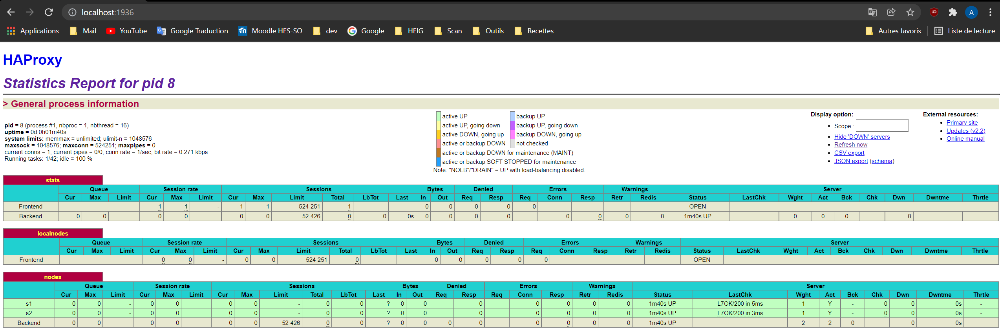
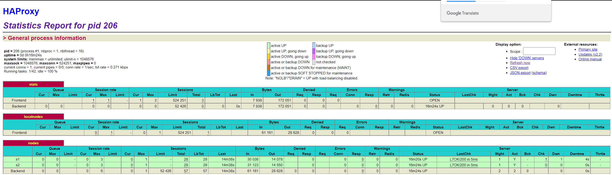
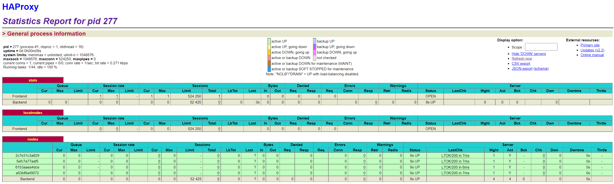

# RAPPORT - Labo 4 - STI

Auteurs : Axel Vallon, Lev Pozniakoff et Robin Gaudin

Date : 13.12.2021

## Table of content

[TOC]

## Introduction

L'objectif de ce laboratoire est de reprendre le travail effectué dans le laboratoire précédent, soit une architecture avec un load balancer, et d'essayer de rendre la configuration la plus dynamique possible. Ce document contient la réponse aux questions demandée dans ce laboratoire d'AIT effectué à la HEIG-VD en 2022.

## Task 0 - Identify issues and install the tools

1. **[M1]** Do you think we can use the current
   solution for a production environment? What are the main problems
   when deploying it in a production environment?

   **Réponse : **Non, il n'est pas réellement possible de l'utiliser actuellement en production, car il n'est pas actuellement possible de gérer notre infrastructure automatiquement (ajout/supression de noeud...). Les problème lié à ceci serait que des actions manuelles seraient nécessaires afin de résoudre des problèmes sur l'infrastructure, tel qu'une augmentation de traffic ou même un problème lié au matériel.

------

2. **[M2]** Describe what you need to do to add new
   `webapp` container to the infrastructure. Give the exact steps of
   what you have to do without modifiying the way the things are
   done. Hint: You probably have to modify some configuration and
   script files in a Docker image.

   **Réponse : **Il faudrait suivre la procédure suivante :
   
   1. Modifier le fichier `.env` pour ajouter un nouveau container avec une nouvelle adresse IP et nommé par exemple `s3` pour suivre la logique de nommage actuelle.
   
   2. Ajouter une image dans le fichier `docker-compose.yml` en se basant sur ceux précédemment créé en le nommant `webapp3`
   
   3. Ajouter ce nouveau noeuds à la configuration de `HAProxy`
   
   4. Redémarrer `HAProxy` pour prendre en compte la nouvelle configuration
   
   5. Démarrer le nouveau container avec
   
      ```bash
      docker-compose build
      docker-compose up -d webapp3
      ```

------

3. **[M3]** Based on your previous answers, you have
   detected some issues in the current solution. Now propose a better
   approach at a high level.

   **Réponse : ** En prenant en compte ce qui a été dit précédemment, la chose que l'on peut mettre en place est la mise à jour automatique de la configuration du `HAProxy`, afin que l'on puisse ajouter et supprimer des noeuds sans devoir en modifier la configuration manuellement.

------

4. **[M4]** You probably noticed that the list of web
   application nodes is hardcoded in the load balancer
   configuration. How can we manage the web app nodes in a more dynamic
   fashion?

   **Réponse : **Il faut qu'on puisse être capable d'identifier quels noeuds sont actif, avec quelles adresses IP, et l'arrêt de ces noeuds. En étant capable d'observer ces événement, ils sera possible de modifier dynamiquement la configuration du load balancer, en supprimant et en ajoutant les noeuds actif dans les noeuds disponible pour le load balancer. 

------

5. **[M5]** In the physical or virtual machines of a
   typical infrastructure we tend to have not only one main process
   (like the web server or the load balancer) running, but a few
   additional processes on the side to perform management tasks.

   For example to monitor the distributed system as a whole it is
   common to collect in one centralized place all the logs produced by
   the different machines. Therefore we need a process running on each
   machine that will forward the logs to the central place. (We could
   also imagine a central tool that reaches out to each machine to
   gather the logs. That's a push vs. pull problem.) It is quite
   common to see a push mechanism used for this kind of task.

   Do you think our current solution is able to run additional
   management processes beside the main web server / load balancer
   process in a container? If no, what is missing / required to reach
   the goal? If yes, how to proceed to run for example a log
   forwarding process?

   **Réponse : **Actuellement, notre infrastructure ne peut pas accueillir plusieurs service car il s'agit là du comportement par défaut d'un containeur. Il est recommandé de ne pas utiliser plusieurs service par containeur, car cela n'a pas été conçu pour. Cependant, il est quand même possible de le faire par 2 moyens assez similaires en modifiant l'image créé avec :
   
   1. Le premier consiste à utiliser un script (processus d'entrée) qui initialise tous les services :
   
      ```bash
      #!/bin/bash
      
      # Start the first process
      ./my_first_process &
        
      # Start the second process
      ./my_second_process &
        
      # Wait for any process to exit
      wait -n
        
      # Exit with status of process that exited first
      exit $?
      ```
   
      Et de le lancer avec `CMD ./script-ci-dessus.sh`. Cependant, il est compliqué de voir ce qui se passe dans ces processus et il est nécessaire de modifier ce script à chaque fois qu'on modifie quelque chose.
   
   2. Le deuxième moyen est d'utiliser des outils comme S6, qui font environ la même chose que le point ci-dessus en mieux et nous permettent en tant que processus principal de créer autant de services que l'on veut (processus enfant), avec moins d'inconvénents de gestions de services (processus zombie, exceptions ...) car nous avons juste à tous les copier dans un dossier, et il s'occupe de gérer les services. 
   
   Donc pour répondre à la question initiale, si on souhaitait ajouter un service d'envoi de log sans utiliser une de ces 2 options, ce serait impossible, car l'application par défaut est déjà le point d'entrée. 

------

6. **[M6]** In our current solution, although the
   load balancer configuration is changing dynamically, it doesn't
   follow dynamically the configuration of our distributed system when
   web servers are added or removed. If we take a closer look at the
   `run.sh` script, we see two calls to `sed` which will replace two
   lines in the `haproxy.cfg` configuration file just before we start
   `haproxy`. You clearly see that the configuration file has two
   lines and the script will replace these two lines.

   What happens if we add more web server nodes? Do you think it is
   really dynamic? It's far away from being a dynamic
   configuration. Can you propose a solution to solve this?

   **Réponse : ** Si on rajoute plus de noeuds, ceux-ci ne seront pas disponible. Cependant, si on veut que ce noeuds soit disponible, on devra toujours modifier la configuration HAProxy pour ajouter plus de `sed`. Donc, évidemment, ce n'est pas dynamique, mais pour le devenir, il est possible d'utiliser un moteur de template, qui va adapter notre configuration `haproxy.cfg` avec les `sed` adapté en cas d'ajout ou suppression de noeud.

**Deliverables**

1. > Take a screenshot of the stats page of HAProxy at
   > <http://192.168.42.42:1936>. You should see your backend nodes.

   

2. > Give the URL of your repository URL in the lab report.

   https://github.com/Semestre5/Teaching-HEIGVD-AIT-2020-Labo-Docker

## Task 1 - Add a process supervisor to run several processes

1. Take a screenshot of the stats page of HAProxy at
   <http://192.168.42.42:1936>. You should see your backend nodes. It
   should be really similar to the screenshot of the previous task.



2. Describe your difficulties for this task and your understanding of
   what is happening during this task. Explain in your own words why
   are we installing a process supervisor. Do not hesitate to do more
   research and to find more articles on that topic to illustrate the
   problem.

Il n'y a pas eu de grande diffculté à suivre cette installation, mais avons du faire quelques recherches pour mieux comprendre ce qui allait être fait. 

Nous avons utiliser ce superviseur de processus afin de pouvoir avoir plusieurs services en même temps sur un containeur, et pouvoir tous les démarer en même temps. Il serait possible de le faire autremenent, mais nous devrions créer un processus qui gère les autre processus, ce qui alourdi le système. Les autres avantages que nous avons pu trouver sont les suivants :

- Comme il s'agit du processus principal, nous n'auront pas de processus zombie.
- Permet d'avoir une meilleure utilisation de docker qu'avec "un processus par containeur" car permet d'effectuer une réelle opération pas container, et pas seulement une petite fonctionnalité.
- En cas d'erreur, il est possible de les gérer sans éteindre le containeur, ce qui permet de le grader allumé 24h/24h. Attention : ce n'est pas forcément une bonne pratique, en cas d'échec du containeur, celui-ci devrait s'éteindre !

Source : https://github.com/just-containers/s6-overlay

## Task 2 - Add a tool to manage membership in the web server cluster

1. > Provide the docker log output for each of the containers: `ha`,
   > `s1` and `s2`. You need to create a folder `logs` in your
   > repository to store the files separately from the lab
   > report. For each lab task create a folder and name it using the
   > task number. No need to create a folder when there are no logs.

Voir dossier `/logs/task 2/`

2. > Give the answer to the question about the existing problem with the
   > current solution.

Le problème actuel est que le cluster peut continuer à exister malgrè le fait que le node de load-balancing ne soit plus en marche. Ceci n'est donc pas une solution tout à fait adaptée à notre environnement. L'idéal serait que les nodes puissent rejoindre le cluster seulement si le load-balancer est allumé, et que le cluster soit détruit lorsque le load-balancer quitte le cluster. Il est cependant compliqué de mettre en place ceci, et c'est pour cela que ça n'a pas été mis en place.

3. > Give an explanation on how `Serf` is working. Read the official
   > website to get more details about the `GOSSIP` protocol used in
   > `Serf`. Try to find other solutions that can be used to solve
   > similar situations where we need some auto-discovery mechanism.

Serf utilise le protocole Gossip pour communiquer au sein du cluster. Il permet à n'importe quel noeud de rejoindre un cluster en connaissant seulement une adresse IP membre du cluster, et fonctionne sur des échange complet entre les noeuds à des intervales spécifiés par une configuration. Ce protocole est aussi capable d'identifier des échec de certaines noeuds.

Il est possible de trouver sur la documentation de Serf d'autres logiciels qui résolvent les même problèmes. Ils ont donc discuté des avantages de leur solutions avec les autres disponibles, et spécifie qu'il est parfois possible de faire fonctionner ces solutions en parallèle.

**Sources :** 

https://www.serf.io/docs/internals/gossip.html#swim-protocol-overview

https://www.serf.io/intro/vs-other-sw.html. 

## Task 3 - React to membership changes

voir dossier `/logs/task 3`

## Task 4 - Use a template engine to easily generate configuration files

> 1. You probably noticed when we added `xz-utils`, we have to rebuild
>    the whole image which took some time. What can we do to mitigate
>    that? Take a look at the Docker documentation on
>    [image layers](https://docs.docker.com/engine/userguide/storagedriver/imagesandcontainers/#images-and-layers).
>    Tell us about the pros and cons to merge as much as possible of the
>    command. In other words, compare:
>
>   ```
> RUN command 1
> RUN command 2
> RUN command 3
>   ```
>
>   vs.
>
>   ```
> RUN command 1 && command 2 && command 3
>   ```
>
>   There are also some articles about techniques to reduce the image
>   size. Try to find them. They are talking about `squashing` or
>   `flattening` images.

Il est déconseillé d'utiliser le `&&` car il compresse artificiellement deux commandes `RUN` (donc c'est la même chose que faire en plusieurs ligne). De plus, c'est plus compliqué à maintenir et il est facile d'oublier un retour à la ligne. L'avantage cependant d'utiliser `&&` pourrait être le regroupement logique de certains appel, tel que les appels à `apt-get install` qui pourraient être multiple.

https://docs.docker.com/develop/develop-images/dockerfile_best-practices/

**Articles trouvé :**

http://jasonwilder.com/blog/2014/08/19/squashing-docker-images/

https://l10nn.medium.com/flattening-docker-images-bafb849912ff

2. > Propose a different approach to architecture our images to be able
   > to reuse as much as possible what we have done. Your proposition
   > should also try to avoid as much as possible repetitions between
   > your images.

Dans le cas de l'application actuelle, il sera pertinant d'utiliser le `muti-stage build`. Il faudra alors mettre en commun tout ce qui est dans les deux images, et par la suite spécifier ce qui est lié au développement des deux containeurs dans leurs image spécifique. Il est possible d'aller plus loin, mais ce serait peu pertinant avec la stucture actuelle, et complexifierait toute modification.

https://docs.docker.com/develop/develop-images/multistage-build/

3. > Provide the `/tmp/haproxy.cfg` file generated in the `ha` container
   > after each step.  Place the output into the `logs` folder like you
   > already did for the Docker logs in the previous tasks. Three files
   > are expected.
   >
   > In addition, provide a log file containing the output of the 
   > `docker ps` console and another file (per container) with
   > `docker inspect <container>`. Four files are expected.

Voir dossier `/logs/task 4`

4. > Based on the three output files you have collected, what can you
   > say about the way we generate it? What is the problem if any?

Ils permettent de vérifier que lorsqu'un nouveau membre arrive dans le cluster, le template est correctement mis à jour. Sur la façon de le générer, c'est quelque chose qui est très pratique pour des fichiers de configuration, mais pas utile dans le cas présent.

## Task 5 - G-enerate a new load balancer configuration when membership changes

1. > Provide the file `/usr/local/etc/haproxy/haproxy.cfg` generated in
   > the `ha` container after each step. Three files are expected.
   >
   > In addition, provide a log file containing the output of the 
   > `docker ps` console and another file (per container) with
   > `docker inspect <container>`. Four files are expected.

   Voir fichiers : `/logs/task 5/1-*`

2. > Provide the list of files from the `/nodes` folder inside the `ha` container.
   > One file expected with the command output.

   Voir fichiers : `/logs/task 5/2-*`

3. > Provide the configuration file after you stopped one container and
   > the list of nodes present in the `/nodes` folder. One file expected
   > with the command output. Two files are expected.
   >
   >  In addition, provide a log file containing the output of the 
   > `docker ps` console. One file expected.

   Voir fichiers : `/logs/task 5/3-*`

4. > (Optional:) Propose a different approach to manage the list of backend
   > nodes. You do not need to implement it. You can also propose your
   > own tools or the ones you discovered online. In that case, do not
   > forget to cite your references.

   On pourrait utiliser un autre outil, comme `Consul`. "Consul est un outil distribué, hautement disponible et compatible avec plusieurs centres de données pour la découverte, la configuration et l'orchestration des services. Consul permet un déploiement, une configuration et une maintenance rapides d'architectures orientées services à grande échelle. " 
   
   Il est plus simple d'utiliser ce genre d'outil car tout est déjà inclus dedant (ou presque), même l'outil de templating.
   
   https://hub.docker.com/_/consul
   
   https://www.consul.io/

## Task 6 - Make the load balancer automatically reload the new configuration

1. > Take a screenshots of the HAProxy stat page showing more than 2 web
   > applications running. Additional screenshots are welcome to see a
   > sequence of experimentations like shutting down a node and starting
   > more nodes.
   >
   > Also provide the output of `docker ps` in a log file. At least 
   > one file is expected. You can provide one output per step of your
   > experimentation according to your screenshots.

   

2. > Give your own feelings about the final solution. Propose
   > improvements or ways to do the things differently. If any, provide
   > references to your readings for the improvements.

   La solutions finale est tout a fait applicable actuellement, mais il est toujours trop long d'ajouter ou supprimer des noeuds, donc ce que l'on propose serait la mise en place d'une interface permettant d'ajouter ou supprimer des noeuds sans devoir modifier le fichier de configuration de docker-compose `docker-compose.yml`. Il existe des solutions existante comme `portainer` qui permettent de visualiser et créer des noeuds simplement.

## Difficulties

La plus grande difficulté de ce laboratoire a été d'être très conscient sur ce qui était fait, et donc ne pas oublier des étapes, malgrès le fait que ce soir très clair. Malgrès toutes les explication, il n'est pas forcément facile de comprendre le rôle de tout les composant mis en place du premier coup d'oeil.

Pour les problème de suivi (qui sont arrivée parfois), les seules solutions que l'on trouvait était de revérifier chaque point effectué depuis la dernière vérification, jusqu'à trouver une options incorrectes. La consigne suffisait emplement pour répondre à toutes les difficultés.

## Conclusion

Malgrè la longueur évidente de ce laboratoire, nous avons aimé créer une infrastructure dynamique complète comme celle-ci pour une première fois. Il serait même intéressant d'aller plus loin, mais comme dit avant, c'était déjà très long ... 